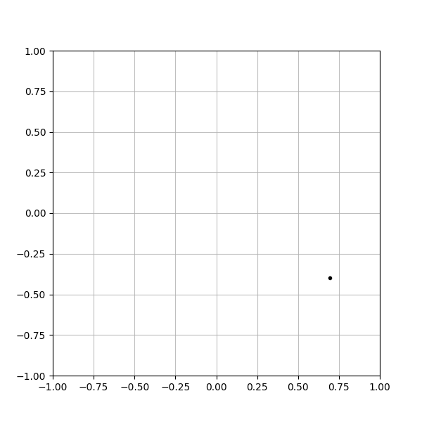
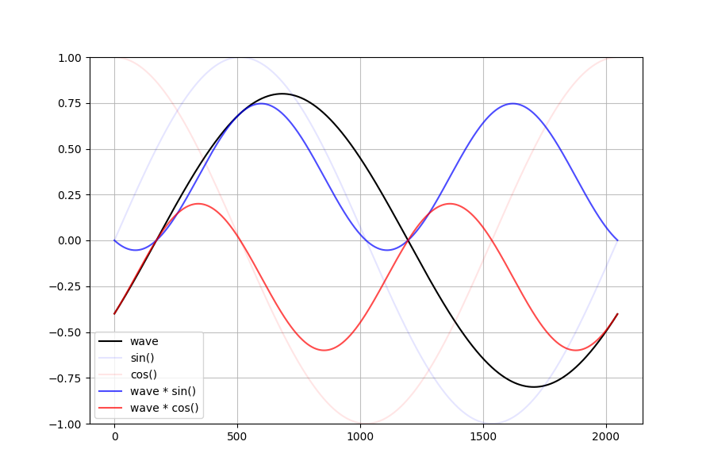
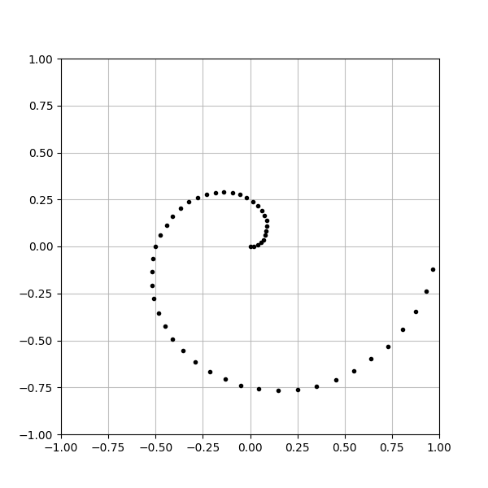

# A simple singlepoint fourier transform simulation

## What is this? 
Demonstratts how the real/imag componets can be found at specific frequency. 

## Demo scripts
This repository contains two demo scripts. 

### singlepoint.py
Parameters for measureing waveform can be edited in the script.  
Following plots are with ..  
- frequency = 1
- amplitude = 0.8
- phase = 330°  
#### _nyquist plot_  
  
#### _timedomain plot_
  

### multi_singlepoints.py
Parameters for measureing waveform can be edited in the script.  
Following plots are with ..  
- measured points = 50
- frequency = 1~50
- amplitude = 0~352.8°
- noise amplitude = 0.1  
#### _nyquist plot_  
  
#### _timedomain plot: animated for each frequency steps_  
  

